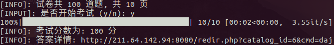

# 实验室安全考试系统题库爬取+自动答题

> 主要是应对中国海洋大学(OUC)的[实验室安全考试系统](http://211.64.142.94:8080)，主要功能是模拟登陆、题库的爬取以及自动答题。3秒结束答题，灰常方便 =v=
>
> 注：
>
> - 校园网下才可以访问这个考试系统。。
> - 本程序仅供学习交流，使用该程序产生的后果由使用者负责

## 安装依赖

```bash
$ pip3 install -r requirements.txt
```

## 用法

1. 在终端或cmd使用python执行`labtest.py`文件：

   ```bash
   $ python3 labtest.py
   ```

2. 登录实验室安全考试系统

   按提示输入学号、密码和验证码，登陆成功时会显示状态码`004`

   

3. 下载需要的题库

   > **必须下载与考试相应的题库，否则自动答题的时候没有题库或者题库错误的话，会答错很多= =**

   

   输入需要下载的题库号即可。

   

   下载成功后，会在当前目录生成题库文件`database.csv`

4. 自动考试

   


## To do

- [ ] 优化题目搜索部分
- [ ] 将自测练习url更换为考试url（需要等考试开放）

## License

MIT